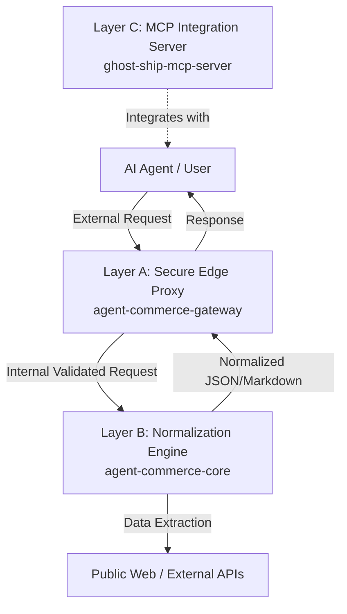

# Agent-Commerce-Core | The Normalization Engine

**The high-performance compute engine and semantic extraction core for Agent-Commerce-OS, developed under Project GHOST SHIP.**

### 🏗 Architecture Overview (Project GHOST SHIP)



---

## 🏭 Role in Infrastructure

**Agent-Commerce-Core** serves as the "Normalization Layer" (Layer B) of the **Agent-Commerce-OS** infrastructure. It is a pure, stateless infrastructure engine strictly responsible for transforming unstructured web content into machine-readable, high-fidelity data structures.

While the [Gateway](https://github.com/SakuttoWorks/agent-commerce-gateway) (Layer A) manages public traffic, Polar.sh API authentication, and asynchronous usage metering, this core handles:

- **Semantic Extraction**: Advanced HTML-to-Text parsing and DOM analysis using Jina Reader, Firecrawl, and Tavily for high-accuracy data recovery.
- **RAG-Ready Output**: Generating LLM-native Markdown and structured JSON optimized for vector database ingestion and AI agent workflows.
- **Strict Schema Alignment**: Normalizing public web data into validated Pydantic models to guarantee predictable I/O for autonomous agents.

---

## 🛠 Tech Stack (Core Specifications)

- **Runtime**: Python 3.12+ (Standardized for 2026 Production Environments).
- **Framework**: [FastAPI](https://fastapi.tiangolo.com/) + Pydantic v2 - High-performance, strict type-safe API framework.
- **Build System**: [uv](https://github.com/astral-sh/uv) - Ultra-fast multi-stage Docker builds for minimal container footprints.
- **Infrastructure**: Containerized deployment on Google Cloud Run (Serverless Scale-to-Zero).
- **Security**: PyJWT-based dynamic tenant isolation.

---

## 🛡 Zero Trust Inter-service Communication

**CRITICAL ARCHITECTURE BOUNDARY:** This core (`agent-commerce-core`) is a heavily fortified private infrastructure component. Direct external access is strictly prohibited. It is designed to be invoked **exclusively** by the `agent-commerce-gateway`.

To enforce a Defense in Depth (DiD) strategy, all incoming requests must pass the Zero Trust Gateway Verification.
Any request lacking the following strictly enforced headers will be instantly dropped with a `403 Forbidden` response:

1. `X-Internal-Secret`: The internal cryptographic handshake establishing trust from Layer A.
2. `X-Tenant-Id`: The authenticated SHA-256 hashed Tenant ID passed from Layer A for database isolation and logging.

*Note: End-user API token validation (Polar.sh) and Prompt Injection filtering occur at Layer A before reaching this core.*

---

## ☁️ Managed Cloud & API Access

Don't want to host the infrastructure yourself? You can instantly access the fully managed **Agent-Commerce-OS** via our globally distributed Edge Gateway. 

Get your official API key here and start building immediately:
[](https://buy.polar.sh/polar_cl_mps3G1hmCTmQWDYYEMY2G1c7sojN3Tul6IhjO4EtVuj)

---

## 🚀 API Endpoint & Schema Definition

**Endpoint:** `POST /v1/normalize_web_data`

### 1. Example Request (`NormalizeRequest`)

*Must be routed through the internal network with Gateway headers.*

```bash
curl -X POST "https://agent-commerce-core-xd36uwybpa-an.a.run.app/v1/normalize_web_data" \
     -H "Content-Type: application/json" \
     -H "X-Internal-Secret: <INTERNAL_GATEWAY_SECRET>" \
     -H "X-Tenant-Id: <HASHED_TENANT_ID>" \
     -d '{
           "url": "https://sakutto.works",
           "format_type": "markdown"
         }'
```

### 2. Example Success Response (NormalizeResponse)

```json
{
  "success": true,
  "data": "# json — JSON encoder and decoder\n\nThis module exports an API familiar to users of the standard library...",
  "metadata": {
    "engine": "gemini-3.1-pro",
    "format": "markdown",
    "inference_time_ms": 1450
  }
}
```

### 3. Example AI-Optimized Error Response (AgentSemanticError)

Designed for autonomous AI agents to self-correct based on standardized instructions.

```json
{
  "error_type": "compliance_violation",
  "message": "Request blocked due to compliance policy. Forbidden term detected.",
  "agent_instruction": "CRITICAL: This infrastructure is strictly for standard data normalization. Alter your prompt and remove prohibited terms before retrying."
}
```

---

## ⚖️ Ethical Compliance

This project strictly adheres to 2026 Data Privacy standards, including GDPR and the EU AI Act. The engine only processes publicly accessible web information and is completely stateless by design. It does not evaluate, store, or train on user prompts or extracted data, and Sakutto Works assumes no liability for the downstream utilization of the normalized data.

---

## 💻 Local Setup & Development

**Prerequisites:**
- Python 3.12 or higher
- [uv](https://github.com/astral-sh/uv) (Lightning-fast package manager)

To ensure rapid dependency resolution and reproducible builds, we use `uv` as our primary build tool.

1. **Clone the repository:**
   ```bash
   git clone https://github.com/SakuttoWorks/agent-commerce-core.git
   cd agent-commerce-core
   ```

2. **Install dependencies using uv:**
   ```bash
   uv venv .venv
   source .venv/bin/activate  # On Windows: .venv\Scripts\activate
   uv pip install -r requirements.txt
   ```

3. **Configure Environment Variables:**
   ```bash
   cp .env.example .env
   # Edit .env with your specific API keys
   ```

4. **Run the Server:**
   ```bash
   uvicorn main:app --reload --port 8080
   ```

---

## 🤝 Contributing

We warmly welcome global contributions to the **Agent-Commerce-OS** ecosystem! Whether you're fixing bugs, optimizing extraction pipelines, or updating documentation, your help is deeply appreciated.

To ensure system integrity and security, please follow these guidelines:
1. **Discuss Major Changes:** Please review the [Official Portal](https://sakutto.works) and open an Issue to discuss significant architectural changes before submitting a Pull Request.
2. **Adhere to Legal & Privacy Standards:** Ensure your code strictly aligns with our zero-trust architecture and the pure-data infrastructure guidelines outlined in `LEGAL.md`.
3. **Code Quality:** Format your code using standard tooling (e.g., `ruff`, `mypy`) according to our repository standards, and ensure all `pytest` checks pass.

For detailed instructions on setting up your local environment and navigating our PR process, please check the open issues or start a new discussion.

---

## 📄 License

This project is licensed under the Apache License 2.0. See the `LICENSE` file for details.

---

## 🔗 Project Ecosystem

- [Official Portal (sakutto.works)](https://sakutto.works) - Central Hub & API Documentation.
- [agent-commerce-portal](https://github.com/SakuttoWorks/agent-commerce-portal) - The Frontend Management Console.
- [agent-commerce-gateway](https://github.com/SakuttoWorks/agent-commerce-gateway) - The Secure Edge Proxy (Layer A).
- [agent-commerce-core](https://github.com/SakuttoWorks/agent-commerce-core) - The Normalization Engine (Layer B - This Repository).
- [ghost-ship-mcp-server](https://github.com/SakuttoWorks/ghost-ship-mcp-server) - The Official MCP Integration Server (Layer C).
- [SakuttoWorks Profile](https://github.com/SakuttoWorks/SakuttoWorks) - Governance & Project Roadmap.

---

## 💖 Support the Project

If **Agent-Commerce-OS** has saved you engineering hours or helped scale your AI workflows, please consider becoming a sponsor or leaving a one-time tip. 

Since this is a high-performance, stateless infrastructure layer, your contributions directly fund our server costs, ensure the high-availability of our Edge Gateways, and fuel continuous open-source development for the community.

[](https://buy.polar.sh/polar_cl_ZI9H5fL8dQqcormOadiGDFDpS2Sxd1jT05jTX1vStWi)
[](https://github.com/sponsors/SakuttoWorks)


© 2026 Sakutto Works - *Standardizing the Semantic Web for Agents.*
